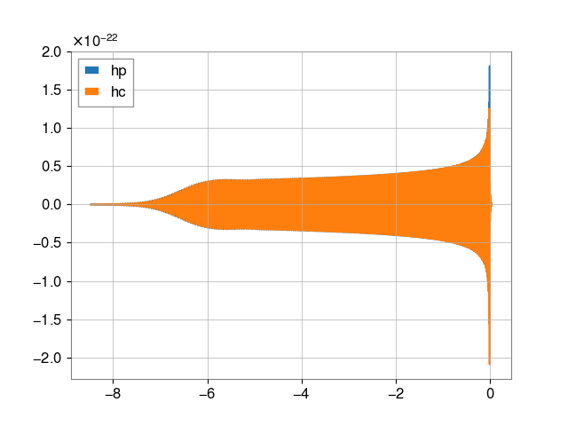

Usage
============

This page should provide a user with the quick instructions on how to generate waveforms in python using :code:`GWSignal`.

Generate LAL Waveform
---------------------
Generation of a waveform goes through three basic steps:

* Define set of intrinsic / extrinsic parameters along with proper units. Unitless inputs of a dictionary can be converted to :code:`GWSignal` parsable parameter dictionary by using the :code:`add_params_units` function.

* Initiate an instance of the Generator class, in this case, the :code:`LALCompactBinaryCoalescenceGenerator`.

* Generate time-domain waveform using the :code:`GenerateTDWaveform` function.

Frequency domain waveforms can be generated using the `GenerateFDWaveform` function. In case a generator does not provide a method to generate time (frequency) domain
waveform; set :code:`condition = 1` in the dictionary of parameters.

.. code-block:: python

	import astropy.units as u
	import lalsimulation.gwsignal.core.waveform as wfm
	import numpy as np
	import matplotlib.pyplot as plt

	# Define the dictionary
	deltaT = 1./1024.*u.s
	f_min = 20.*u.Hz
	f_ref = 20.*u.Hz
	distance = 1000.*u.Mpc
	inclination = 0.*u.rad
	distance = 1000.*u.Mpc
	inclination = 0.*u.rad
	phiRef = 0.*u.rad
	eccentricity = 0.*u.dimensionless_unscaled
	longAscNodes = 0.*u.rad
	meanPerAno = 0.*u.rad

	parameters_dict = {'mass1' : 10*u.solMass,
	                   'mass2' : 10*u.solMass,
	                   'deltaT' : deltaT,
	                   'f22_start' : f_min,
	                   'f22_ref': f_ref,
	                   'phi_ref' : phiRef,
	                   'distance' : distance,
	                   'inclination' : inclination,
	                   'eccentricity' : eccentricity,
	                   'longAscNodes' : longAscNodes,
	                   'meanPerAno' : meanPerAno,
	                   'condition':0
	                   }

	# Define the approximant
	approximant = 'IMRPhenomXP'

	# Call the generator
	gen = wfm.LALCompactBinaryCoalescenceGenerator(approximant)

	# Generate waveform
	hp, hc = wfm.GenerateTDWaveform(parameters_dict, gen)

	# Plot the waveform hp and hc polarizationsy

	f,ax = plt.subplots()

	ax.plot(hp,label='hp')
	ax.plot(hc,label='hc')
	ax.legend()

